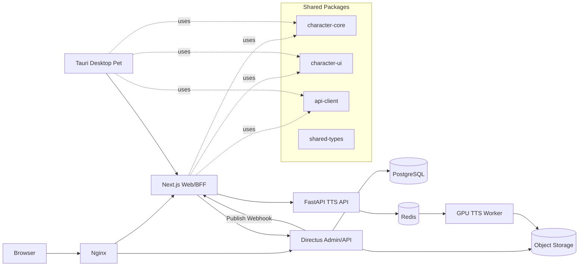

# AsaHome Coding Agent 开发规范与分阶段实施计划

> 文档状态：Approved Baseline  
> 适用对象：Coding Agent、项目维护者、后续协作者  
> 基线日期：2026-06-25  
> 项目性质：非官方、完全非商业化的 ASa Project 主题个人技术展示网站  
> 首要原则：**先交付稳定的网站与内容系统，再以独立服务加入 TTS，最后加入网页角色与本地桌宠。**

---

## 0. Coding Agent 必读指令

Coding Agent 在修改本项目之前，必须先阅读本文件。实现过程中必须遵守以下规则：

1. 不得跨阶段偷偷实现功能。当前阶段之外的功能只能留下**接口、类型、占位页面和扩展点**。
2. 不得把 Blog、角色、发布包、TTS 模型等业务数据硬编码在前端源码中。
3. 不得要求发布新文章时修改源码、提交 Markdown 或重新构建网站。
4. 不得让浏览器直接访问 Directus 管理令牌、GPU 推理端口或对象存储密钥。
5. 不得将游戏解包得到的原始音频、文本、立绘、模型权重或其他受版权保护资源提交到公开 Git 仓库。
6. 未经 ADR（Architecture Decision Record）说明，不得替换核心技术栈、添加第二套状态管理方案、第二套 API 风格或重复功能的依赖。
7. 所有外部依赖必须固定版本并提交 lockfile；禁止在生产镜像中使用无版本约束的 `latest`。
8. 每个功能必须同时提交实现、测试、必要文档和配置示例。
9. 发现需求与本规范冲突时，不得自行猜测，应在 PR/任务说明中列出冲突和建议方案。
10. 任何涉及版权、模型公开、算法备案、生成内容标识、隐私或桌面应用签名的问题，必须标记为 **Human Review Required**，不得由 Coding Agent 擅自视为已解决。

---

# 1. 项目定义

## 1.1 项目目标

AsaHome 是一个面向中国大陆访问者的个人技术展示站，围绕 ASa Project 作品建立以下能力：

- 发布站长个人 Blog、杂谈、逆向工程记录和开发日志；
- 展示角色、作品及项目相关内容；
- 提供中文输入到日文角色语音的在线 TTS 服务；
- 在网页中展示基于立绘切换的动态角色；
- 提供 Windows 和 macOS 本地桌宠的下载、文档和更新；
- 展示从逆向数据处理、模型训练、Web 服务到桌面客户端的完整技术链路。

## 1.2 明确不属于当前目标的内容

以下内容不应在前三阶段中擅自加入：

- 用户注册、社区、评论、论坛、投稿；
- 付费、广告、赞助、会员、积分或配额购买；
- Live2D、Spine、VRM 或复杂骨骼动画；
- 桌宠屏幕识别、主动 Agent、长期记忆、文件访问或浏览器控制；
- 在桌宠中本地运行大型 TTS 模型；
- Kubernetes、Service Mesh、微服务治理平台；
- 多租户 CMS；
- 将完整游戏资源做成公开下载站；
- 将 Sakura 或 AIRI 整体 fork 后直接改造成 AsaHome。

## 1.3 项目约束

- 项目完全非商业化。
- Blog 仅由站长发布。
- Blog 数据与网站展示代码必须解耦。
- 发布文章不得要求 Git commit 或重新构建。
- 网站主要服务中国大陆用户。
- Web 与桌宠应尽量复用角色协议、类型和 UI 逻辑。
- 第一版角色动画只使用图片状态切换、淡入淡出、轻微浮动或序列帧。
- Windows 与 macOS 是桌宠正式支持目标；Linux 只作为可选实验目标。
- TTS 与桌宠必须是可独立部署、独立关闭、独立升级的模块。

---

# 2. 已确认的技术决策

## 2.1 核心技术栈

| 领域 | 采用方案 | 说明 |
|---|---|---|
| Web 应用 | Next.js App Router + React + TypeScript | 同时承担内容展示、交互页面和服务端 BFF |
| 样式 | Tailwind CSS + 项目自定义 Design Tokens | 不依赖现成主题决定整体视觉 |
| 内容管理 | Directus | 提供后台、内容模型、文件管理、权限和 API |
| 关系数据库 | PostgreSQL | Directus 业务数据的唯一事实来源 |
| Web 数据访问 | Directus SDK 或封装后的 REST 客户端 | 只允许服务端持有管理凭证 |
| Web 缓存刷新 | Directus Flow/Webhook + Next.js 按标签重验证 | 发布文章后无需重新构建 |
| TTS API | FastAPI + Pydantic | 与 Python/CUDA/TTS 生态隔离 |
| 异步任务 | Redis + Celery | TTS 任务排队与 GPU Worker 解耦 |
| 文件存储 | 开发环境本地卷；生产目标为对象存储 | 图片、生成音频、桌宠发布包分桶或分前缀管理 |
| 桌面客户端 | Tauri 2 + Vite + React + TypeScript | 支持 Windows/macOS，复用 Web 技术 |
| Monorepo | pnpm workspace；规模需要时再引入 Turborepo | 避免首期工具过度复杂 |
| 反向代理 | Nginx | TLS、限流、请求体限制和服务路由 |
| 容器化 | Docker Compose | 前三阶段不采用 Kubernetes |
| 测试 | Vitest、React Testing Library、Playwright、pytest | 覆盖单元、组件、端到端和 API |
| CI | GitHub Actions 或等价 CI | lint、类型检查、测试、构建和发布 |

## 2.2 为什么采用该方案

### Next.js

Next.js 负责：

- 首页、Blog、角色页、TTS 页面和桌宠下载页；
- SSR/缓存页面；
- 仅供服务端使用的 Directus 数据访问；
- 对浏览器隐藏内部服务地址；
- 对 TTS API 进行鉴权、限流和输入校验；
- 接收 Directus Webhook 并刷新内容缓存。

生产环境不得直接暴露 Next.js Node 端口，必须置于 Nginx 等反向代理之后。

### Directus

Directus 是内容和文件管理后台，而不是网站展示层。它负责：

- Blog 的创建、编辑、草稿和发布；
- 标签、封面、角色资料、桌宠版本数据；
- 后台账号和权限；
- REST/GraphQL/SDK API；
- 文件元数据；
- 发布事件触发 Webhook。

Directus 中的生产内容是唯一事实来源。不得再维护第二套 Markdown 内容目录。

### Tauri

Tauri 用于本地桌宠，而不是网站服务。选择它的原因是：

- 可以复用 React/TypeScript 角色组件和协议；
- 支持 Windows 与 macOS；
- 支持透明窗口、系统托盘、自启动、窗口定位和自动更新；
- 系统能力通过 Rust/Tauri 权限边界暴露，不需要将 Python/Qt UI 再实现一遍。

Sakura 只作为“角色包、角色状态、双语文本、语音和立绘指令”的设计参考；WindowPet 作为透明桌宠、拖动、点击穿透和跨平台发布的工程参考；Project AIRI 作为 Web/桌面/共享包 Monorepo 组织方式的参考。

---

# 3. 总体架构



## 3.1 网络边界

生产环境建议使用以下公开入口：

- `https://asahome.example/`：Next.js 网站；
- `https://cms.asahome.example/`：Directus 后台，仅管理员使用；
- `https://api.asahome.example/`：可选，对外 API 网关；初期可由 Next.js Route Handler 代理；
- 对象存储/CDN 域名：只提供受控静态资源或带有效期的签名 URL。

以下端口不得直接暴露公网：

- PostgreSQL；
- Redis；
- Celery Worker；
- GPU 推理进程；
- Directus 管理数据库连接；
- 未经过 Nginx/BFF 的内部 FastAPI 管理接口。

## 3.2 部署拓扑

### 第一阶段

一台中国大陆 CPU 云服务器即可运行：

- Nginx；
- Next.js；
- Directus；
- PostgreSQL；
- 可选 Redis；
- 本地持久化卷或对象存储。

### 第二阶段

新增独立 GPU 实例：

- FastAPI TTS API；
- Celery GPU Worker；
- NVIDIA Container Runtime；
- 模型和缓存盘。

CPU 服务器与 GPU 服务器优先通过云厂商私有网络通信。GPU 服务不得对互联网开放裸端口。

### 第三阶段

桌宠发布文件由 CI 构建后上传到：

- 对象存储；
- GitHub Releases（可选镜像）；
- Directus `desktop_releases` 记录对应版本、平台、架构、校验和与下载地址。

---

# 4. Monorepo 目录规范

```text
asahome/
├── AGENTS.md
├── README.md
├── pnpm-workspace.yaml
├── package.json
├── pnpm-lock.yaml
├── .env.example
├── .editorconfig
├── apps/
│   ├── web/                         # Next.js
│   └── desktop/                     # 第三阶段：Tauri + Vite + React
├── packages/
│   ├── config-eslint/
│   ├── config-typescript/
│   ├── shared-types/
│   ├── api-client/
│   ├── character-core/              # 第三阶段启用
│   └── character-ui/                # 第三阶段启用
├── services/
│   └── tts-api/                     # 第二阶段启用
├── directus/
│   ├── snapshots/
│   │   └── schema.yaml
│   ├── extensions/
│   └── README.md
├── infrastructure/
│   ├── compose/
│   │   ├── docker-compose.dev.yml
│   │   └── docker-compose.prod.yml
│   ├── nginx/
│   ├── scripts/
│   └── backup/
├── docs/
│   ├── PROJECT_SPEC.md
│   ├── architecture/
│   │   └── adr/
│   ├── api/
│   ├── operations/
│   └── copyright-and-compliance.md
└── .github/
    └── workflows/
```

## 4.1 目录约束

- `apps/web` 不得包含模型代码。
- `services/tts-api` 不得导入 Next.js 内部文件。
- `apps/desktop` 不得直接访问 Directus 管理 API。
- 跨应用复用代码只能放在 `packages/*`。
- 不得通过 `../../../../` 穿越应用目录复用代码。
- Directus Schema 变更必须提交 snapshot，不得只在生产后台手工修改。
- 生产内容不得导出后提交 Git；只有 Schema、配置和可公开的初始种子数据进入仓库。

---

# 5. 数据模型

## 5.1 Phase 1 必需集合

### `posts`

| 字段 | 类型 | 约束 |
|---|---|---|
| `id` | UUID | 主键 |
| `status` | enum | `draft` / `published` / `archived` |
| `title` | string | 必填，1–120 字符 |
| `slug` | string | 必填、唯一、小写 URL 安全 |
| `summary` | text | 必填，建议不超过 240 字符 |
| `content_markdown` | text | 必填，Markdown；默认禁止原始 HTML |
| `cover` | file relation | 可选 |
| `published_at` | datetime | 发布时必填 |
| `created_at` | datetime | 自动 |
| `updated_at` | datetime | 自动 |
| `seo_title` | string | 可选 |
| `seo_description` | text | 可选 |
| `tags` | M2M | 关联 `tags` |

### `tags`

- `id`
- `name`
- `slug`
- `description`

### `site_settings`

单例集合：

- 站点标题；
- 副标题；
- 首页介绍；
- 页脚文本；
- 非官方声明；
- 默认 SEO；
- 社交链接；
- 当前首页背景资源；
- TTS 功能开关；
- 桌宠功能开关。

### `characters`

第一阶段只建立数据结构和资料页所需字段：

- `id`
- `slug`
- `name_zh`
- `name_ja`
- `game_title`
- `description`
- `display_order`
- `status`
- `default_portrait`
- `copyright_notice`

不得在第一阶段实现动态状态机。

### `desktop_releases`

第一阶段只建表，不提供真实发布包：

- `version`
- `channel`
- `platform`
- `arch`
- `download_file` 或 `download_url`
- `sha256`
- `release_notes`
- `published_at`
- `minimum_os_version`

## 5.2 Phase 2 新增集合

### `tts_models`

- `id`
- `character_id`
- `name`
- `version`
- `status`
- `language`
- `sample_rate`
- `description`
- `terms_notice`
- `created_at`

### `tts_jobs`

- `id`
- `public_id`
- `status`
- `character_id`
- `model_id`
- `input_text_hash`
- `translated_text`
- `output_file_key`
- `error_code`
- `created_at`
- `started_at`
- `finished_at`
- `expires_at`
- `request_id`

默认不长期保存用户原始输入。确需保存时必须先由维护者确认隐私策略。

## 5.3 Phase 3 新增集合

### `portrait_states`

- `id`
- `character_id`
- `state_key`
- `display_name`
- `image`
- `fallback_state`
- `transition`
- `duration_ms`
- `display_order`

### `character_packages`

- `id`
- `character_id`
- `schema_version`
- `manifest_file`
- `package_file`
- `sha256`
- `published_at`

---

# 6. 内容与缓存规范

## 6.1 Blog 内容格式

Blog 正文存储为 Markdown，不使用数据库中的可执行 MDX。

允许：

- 标题、列表、引用、表格；
- 代码块；
- 图片；
- 安全的外部链接；
- 脚注；
- 经过白名单控制的自定义短代码。

默认禁止：

- 原始 HTML；
- `<script>`；
- iframe；
- 任意 React 组件；
- 内联事件处理器；
- 来自正文的任意样式注入。

Markdown 渲染必须经过 AST 白名单和 URL 协议校验。

## 6.2 发布刷新流程

```text
Directus 中发布 posts
  -> Directus Flow 触发非阻塞 Webhook
  -> POST /api/internal/revalidate
  -> 校验 HMAC/共享密钥和时间戳
  -> 刷新 posts、post:{slug} 等缓存标签
  -> 返回 204
```

约束：

- Webhook 端点只能接受 POST。
- 请求必须具备签名、时间戳和防重放检查。
- 发布失败不能回滚文章事务；Flow 使用非阻塞 Action。
- Webhook 失败必须可重试并产生结构化日志。
- 单实例部署不需要分布式 Next.js 缓存。
- 扩展到多个 Next.js 实例时，必须重新评估共享缓存和标签同步。

---

# 7. UI 与视觉规范

## 7.1 视觉方向

目标是“Galgame 角色主题 + 现代技术展示”，而不是复刻 ASa Project 官方站，也不是通用 SaaS 后台风格。

关键词：

- 轻盈；
- 柔和；
- 角色优先；
- 阅读友好；
- 技术感作为辅助；
- 大面积留白与半透明卡片；
- 适量日式视觉符号，但不牺牲中文可读性。

## 7.2 Design Tokens

必须在单一位置定义：

- 颜色；
- 字体；
- 圆角；
- 阴影；
- 间距；
- 动画持续时间；
- 内容最大宽度；
- z-index 层级。

禁止组件自行散落硬编码品牌色。

## 7.3 页面清单

第一阶段必须完成：

- `/` 首页；
- `/blog` Blog 列表；
- `/blog/[slug]` Blog 详情；
- `/characters` 角色/作品展示；
- `/about` 项目说明；
- `/tts` TTS 占位页；
- `/pet` 桌宠占位页；
- `/downloads` 下载占位页；
- `/privacy` 隐私说明；
- `/copyright` 版权与非官方声明；
- `404` 和通用错误页。

## 7.4 占位页约束

TTS 与桌宠占位页必须：

- 明确标注“开发中”；
- 解释计划能力；
- 不放置可点击但无效果的生成按钮；
- 不模拟虚假生成结果；
- 不调用任何临时第三方 TTS；
- 预留最终信息架构和 API 类型，但不实现业务逻辑。

## 7.5 响应式与可访问性

- 从 360px 宽度开始可用。
- 背景立绘不得遮挡正文、按钮或导航。
- 图片必须有明确尺寸，避免布局跳动。
- 动画遵守 `prefers-reduced-motion`。
- 所有主要操作可通过键盘完成。
- 图标按钮必须有可访问名称。
- 正文对比度和字号优先于装饰效果。
- 无立绘资源时必须使用项目自制占位图，不得临时抓取网络图片。

---

# 8. 通用工程约束

## 8.1 TypeScript

- `strict: true`。
- 禁止无理由使用 `any`。
- API 响应必须通过运行时 Schema 校验。
- 公共类型定义在 `packages/shared-types`。
- 不得让 Directus 原始响应结构渗透到所有 UI 组件；应通过 mapper 转换为领域模型。

## 8.2 Python

- Python 版本固定在模型生态兼容版本，初始建议 3.11。
- 使用 `pyproject.toml` 和锁文件。
- 使用 Pydantic 定义全部输入输出。
- Ruff 负责 lint/format。
- pytest 覆盖业务逻辑和 API。
- GPU 模型加载不得发生在模块 import 的不可控副作用中。
- 模型生命周期必须可健康检查、可优雅关闭。

## 8.3 环境变量

- 提交 `.env.example`，不得提交真实 `.env`。
- 只有确实需要暴露给浏览器的值才可使用 `NEXT_PUBLIC_`。
- Directus 管理 Token、Webhook Secret、数据库密码、对象存储 Secret、Tauri 签名私钥不得进入客户端包或日志。
- CI Secrets 与生产 Secrets 分离。
- 任何日志都必须脱敏 Authorization、Cookie、Token 和用户输入。

## 8.4 API 风格

- 外部业务 API 使用 `/api/v1/...`。
- 内部管理 API 使用 `/api/internal/...`。
- API 错误统一返回：
  - `code`
  - `message`
  - `request_id`
  - 可选 `details`
- 不向用户返回 Python traceback、SQL 错误或内部主机名。

## 8.5 日志与健康检查

每个服务必须提供：

- `/health/live`
- `/health/ready`

日志至少包含：

- 时间；
- 服务名；
- 环境；
- 日志等级；
- request ID；
- route/job ID；
- 错误 code；
- 耗时。

## 8.6 测试门槛

每个 PR 至少通过：

```text
pnpm lint
pnpm typecheck
pnpm test
pnpm build
pytest
docker compose config
```

涉及用户流程时必须新增 Playwright E2E。

---

# 9. Phase 1：网站整体界面 + Blog + UI，占位 TTS/桌宠

## 9.1 阶段目标

交付一个可公开访问、可通过后台发布文章、视觉完整且具备未来扩展接口的网站。

本阶段结束时：

- 站长可以登录 Directus 发布 Blog；
- 新文章发布后无需改源码或重新构建；
- 首页、Blog、角色资料、About、版权说明完整；
- TTS 与桌宠有正式占位页面；
- 网站部署到测试环境；
- 所有核心服务具备备份和恢复说明。

## 9.2 工作包

### P1.1 仓库与工具链

- 初始化 pnpm workspace。
- 建立 Next.js App Router 项目。
- 配置 TypeScript strict、ESLint、Prettier。
- 创建 `AGENTS.md`，引用本规范。
- 建立 ADR 目录和模板。
- 配置 CI：lint、typecheck、test、build。
- 建立 dev/prod Docker Compose。
- 固定 Node、pnpm、PostgreSQL、Directus 镜像版本。

**验收：**

- 新机器只依赖 Docker、Node 和 pnpm 即可启动开发环境；
- README 提供不超过 10 条命令的启动路径；
- CI 在空白功能状态可通过。

### P1.2 Directus 与数据库

- 启动 PostgreSQL 和 Directus。
- 创建 Phase 1 数据集合。
- 设置管理员角色。
- 公共角色只能读取 `published` 内容和允许公开的文件。
- 导出 `directus/snapshots/schema.yaml`。
- 提供 Schema apply 和 snapshot 脚本。
- 配置本地持久化文件卷。
- 编写数据库和文件备份脚本。

**禁止：**

- 生产使用 SQLite；
- 公共角色具有写权限；
- 将 Admin Token 放入浏览器；
- 只在 UI 手工建表但不提交 Schema snapshot。

**验收：**

- 清空本地数据库后可由脚本恢复 Schema；
- 草稿文章无法通过公开 API 读取；
- 上传封面后网站可显示；
- 删除容器不会删除持久化数据。

### P1.3 Web 数据层

实现统一模块：

```text
apps/web/src/lib/directus/
├── client.server.ts
├── queries/
├── mappers/
├── schemas/
└── errors.ts
```

要求：

- Directus 客户端默认只运行于服务端；
- 所有响应经 Schema 校验；
- 领域类型与 Directus SDK 类型隔离；
- 统一处理 404、CMS 不可用和空内容；
- Blog 列表支持分页、标签和按发布时间倒序；
- 详情页只读取已发布文章。

**验收：**

- Directus 短暂不可用时，页面显示可理解的错误状态；
- 不在浏览器 Network 中出现管理 Token；
- 文章 slug 冲突在 CMS 层被阻止。

### P1.4 Blog 发布闭环

- Directus 中配置发布 Flow。
- 实现签名 Webhook。
- Next.js 使用内容标签缓存。
- 发布、修改、归档文章时刷新对应缓存。
- 为失败 Webhook 提供日志和手动重试说明。

**验收场景：**

1. 创建草稿，公网不可见；
2. 发布文章，不提交 Git；
3. 在合理时间内出现在列表和详情页；
4. 修改标题后页面更新；
5. 归档后列表移除；
6. Webhook 使用错误签名时返回 401/403。

### P1.5 UI 与页面

按第 7 节页面清单完成界面。

首页建议结构：

1. Hero 与项目说明；
2. 最近 Blog；
3. 角色/作品入口；
4. TTS 技术项目预告；
5. 桌宠项目预告；
6. 非官方与非商业声明。

Blog 详情必须包含：

- 标题、摘要、发布时间、标签；
- 正文目录；
- 代码高亮；
- 上一篇/下一篇；
- 版权和引用说明；
- 分享链接；
- 正确的 SEO 元数据。

### P1.6 部署与运维

- Nginx 终止 TLS；
- Next.js、Directus、PostgreSQL 不直接暴露端口；
- 配置请求体大小限制；
- CMS 置于独立子域；
- 数据库每日备份；
- 文件至少每周备份；
- 编写恢复演练步骤；
- 开发、测试、生产配置分离；
- 中国大陆服务器正式对外前完成 ICP 备案流程。

## 9.3 Phase 1 完成定义

只有同时满足以下条件才能进入 Phase 2：

- 所有必需页面上线；
- CMS 发布闭环通过；
- 自动化测试通过；
- 无真实 TTS/桌宠功能混入；
- 生产数据可备份恢复；
- 版权页面和非官方声明存在；
- 站点在移动端可正常阅读；
- 已建立 TTS 与角色系统的 ADR/接口草案；
- 维护者签字确认 Phase 1。

---

# 10. Phase 2：加入 TTS

## 10.1 阶段目标

用户输入中文，选择角色/模型后，系统创建异步任务，完成日文文本处理和角色日语音频生成，并在网页中播放或下载结果。

## 10.2 强制架构

```text
Browser
  -> Next.js BFF
  -> FastAPI
  -> Redis/Celery
  -> GPU Worker
  -> Object Storage
```

浏览器不得直接访问 GPU 服务。

初版使用轮询获取任务状态，不优先实现 WebSocket。只有轮询方案验证后，才允许通过 ADR 增加 SSE/WebSocket。

## 10.3 TTS 服务模块边界

```text
services/tts-api/app/
├── api/
├── core/
├── domain/
│   ├── jobs/
│   ├── translation/
│   └── synthesis/
├── adapters/
│   ├── translation/
│   ├── tts_engine/
│   ├── storage/
│   └── queue/
├── workers/
├── schemas/
└── tests/
```

必须定义以下抽象：

- `TranslationProvider`
- `TTSProvider`
- `ObjectStorage`
- `JobRepository`
- `TaskQueue`

模型实现不能直接写在 FastAPI route 中。

## 10.4 API 合同

### 创建任务

`POST /api/v1/tts/jobs`

```json
{
  "text_zh": "今天也请多关照。",
  "character_id": "character-a",
  "model_id": "character-a-v1",
  "options": {
    "speed": 1.0
  }
}
```

返回：

```json
{
  "job_id": "public-id",
  "status": "queued",
  "created_at": "ISO-8601",
  "request_id": "request-id"
}
```

### 查询任务

`GET /api/v1/tts/jobs/{job_id}`

状态只允许：

```text
queued -> translating -> synthesizing -> uploading -> succeeded
                                          \-> failed
queued/running -> cancelled
succeeded -> expired
```

成功返回：

```json
{
  "job_id": "public-id",
  "status": "succeeded",
  "text_ja": "今日もよろしくお願いします。",
  "audio_url": "short-lived-signed-url",
  "expires_at": "ISO-8601",
  "ai_generated": true
}
```

### 模型列表

`GET /api/v1/tts/models`

只返回启用且允许公开使用的模型。

## 10.5 输入和安全约束

- 输入只接受纯文本。
- 禁止 HTML、SSML 和任意模板表达式。
- 设置字符数、请求频率和并发限制。
- 对相同请求可基于规范化文本、模型版本和参数做缓存。
- 公开任务 ID 必须不可枚举。
- 音频 URL 使用短期签名，不返回对象存储永久密钥。
- 不在普通日志中记录完整用户文本。
- 失败结果不得暴露模型目录和 CUDA traceback。
- GPU Worker 只消费可信队列消息。
- 模型文件只读挂载。
- 上传结果前校验文件类型、大小和时长。

## 10.6 数据保留

默认策略：

- 生成音频 24 小时后过期；
- 任务元数据保留 30 天用于技术统计；
- 用户原始中文不长期保存，只保存不可逆哈希或在任务过期时删除；
- 失败任务的临时文件立即清理；
- 对象存储配置生命周期策略。

该策略上线前由维护者确认。

## 10.7 AI 生成内容标识

TTS 页面和结果必须明显显示：

- “AI 生成语音”；
- 模型名称与版本；
- 生成时间；
- 非官方声明；
- 不得冒充游戏官方原始语音的提示。

下载音频时必须：

- 使用可识别的文件名；
- 写入可行的生成元数据；
- 预留隐式标识处理步骤；
- 在最终上线前由维护者核对适用的中国大陆生成合成内容标识要求。

**这是发布阻断项，不得以“项目非商业化”为由跳过。**

## 10.8 GPU 部署指导

在购买云 GPU 前必须完成本地基准：

- 模型加载显存；
- 峰值显存；
- 1、5、10、30 秒文本的生成耗时；
- 冷启动时间；
- 并发 1 和并发 2 表现；
- 输出音频大小；
- 失败恢复；
- 空闲时资源占用。

云端第一版建议：

- 单 GPU；
- 单 Worker 并发；
- Redis 队列；
- 按量或弹性实例；
- 模型盘持久化；
- Web 服务与 GPU 服务分离。

不得仅凭模型参数量选择 GPU。

## 10.9 Phase 2 测试

必须覆盖：

- 输入校验；
- 状态机合法迁移；
- 幂等与重复请求；
- 队列故障；
- GPU Worker 崩溃；
- 上传失败；
- 超时与取消；
- 过期清理；
- 签名 URL；
- 限流；
- 一个真实模型的冒烟测试；
- 不依赖 GPU 的 Mock Provider 集成测试。

## 10.10 Phase 2 完成定义

- TTS 端到端可用；
- Web 与 GPU 服务完全解耦；
- 模型可替换而不修改 API；
- 任务排队和错误反馈清晰；
- 生成内容标识已实现并通过人工检查；
- 资源清理和成本监控可用；
- 版权与公开范围得到维护者人工确认；
- 无浏览器直连 GPU；
- 有停用 TTS 的功能开关和降级页面。

---

# 11. Phase 3：网页角色 + Windows/macOS 桌宠

## 11.1 阶段目标

使用同一角色协议实现：

1. AsaHome 网页中的简单动态角色；
2. Windows 和 macOS 本地桌宠；
3. 可下载、可校验、可更新的角色包和客户端发布流程。

本阶段不引入 Live2D。

## 11.2 角色 Manifest

必须先定义版本化 JSON Schema：

```json
{
  "schemaVersion": 1,
  "id": "character-a",
  "name": {
    "zh": "角色 A",
    "ja": "キャラクターA"
  },
  "defaultState": "idle",
  "states": {
    "idle": {
      "asset": "portraits/idle.webp",
      "transition": "fade"
    },
    "smile": {
      "asset": "portraits/smile.webp",
      "transition": "crossfade"
    },
    "speaking": {
      "frames": [
        "portraits/speaking-1.webp",
        "portraits/speaking-2.webp"
      ],
      "frameDurationMs": 180
    }
  }
}
```

约束：

- 状态 key 使用稳定英文标识；
- 资源路径只能是角色包内相对路径或经过允许的 HTTPS 地址；
- 禁止 JavaScript、HTML 或可执行脚本进入角色包；
- 必须校验 schemaVersion、文件 hash、文件数量、单文件大小和总包大小；
- 未知状态回退到 `defaultState`；
- 新 schema 必须向后兼容或提供迁移器。

## 11.3 共享包职责

### `character-core`

- Manifest Schema；
- 状态机；
- 状态回退；
- 资源解析；
- 动画计时；
- 事件定义；
- 不依赖 DOM、Next.js 或 Tauri。

### `character-ui`

- React 立绘渲染器；
- 淡入淡出；
- 序列帧；
- Loading/Error/Fallback；
- `prefers-reduced-motion`；
- 可注入资源加载器。

### `api-client`

- 获取角色清单；
- 获取桌宠版本；
- 调用 TTS；
- 统一错误处理；
- Web 与 Desktop 不得各自复制 API 代码。

## 11.4 网页角色

网页角色必须：

- 可开关；
- 不遮挡正文；
- 在移动端默认简化或关闭；
- 图片失败时自动回退；
- 不阻塞首屏；
- 使用懒加载和预加载下一状态；
- 支持点击触发表情；
- 可在 TTS 播放时切到 `speaking`；
- 遵守 reduced motion。

不得：

- 自动播放长音频；
- 未经用户操作播放声音；
- 追踪鼠标造成明显性能消耗；
- 在每个页面重复下载完整角色包；
- 将角色逻辑写死在页面组件中。

## 11.5 Tauri 桌宠 MVP

必须实现：

- 透明无边框窗口；
- 始终置顶；
- 鼠标拖动；
- 点击穿透开关；
- 角色状态切换；
- 系统托盘；
- 显示/隐藏；
- 退出；
- 自启动开关；
- 单实例；
- 记住窗口位置；
- 本地配置；
- Windows/macOS 安装包；
- 版本和更新检查；
- 发布包 SHA-256 校验。

可选：

- 调用 AsaHome TTS；
- 播放网站生成的语音；
- 从 AsaHome 下载新角色包。

明确禁止在 MVP 中实现：

- 屏幕截图；
- 键盘监听；
- 文件系统扫描；
- 浏览器自动化；
- Agent 工具；
- LLM 对话；
- 长期记忆；
- 后台常驻采集。

这些能力虽可参考 Sakura，但不属于 AsaHome 第三阶段目标。

## 11.6 平台实施顺序

1. Windows 开发版；
2. Windows 安装、托盘、穿透和更新；
3. macOS 开发版；
4. macOS 透明窗口、权限和打包；
5. macOS 签名/公证；
6. Windows 签名；
7. 双平台自动更新；
8. Linux 实验构建（不作为发布阻断项）。

macOS 构建必须在 macOS 环境完成。正式分发必须规划 Apple Developer、签名和公证。Windows 未签名应用可能触发 SmartScreen 警告，正式发布前应评估代码签名。Tauri 自动更新包必须使用更新签名，私钥只能存在于安全的 CI Secret 中。

## 11.7 桌宠发布流程

```text
tag vX.Y.Z
 -> Windows CI build
 -> macOS CI build
 -> unit/integration smoke tests
 -> sign/notarize
 -> generate sha256
 -> sign updater artifacts
 -> create draft release
 -> human review
 -> publish files
 -> create/update Directus desktop_releases
 -> website displays download
```

自动更新必须支持：

- 稳定通道；
- 失败回滚或保留旧版本；
- 用户主动确认；
- 更新包签名验证；
- 不执行远程脚本。

## 11.8 Phase 3 测试

### Web

- 角色懒加载；
- 状态切换；
- 回退；
- reduced motion；
- 移动端隐藏策略；
- TTS 播放联动。

### Desktop

- 首次启动；
- 单实例；
- 拖动；
- 点击穿透；
- 多显示器；
- 高 DPI；
- 托盘菜单；
- 自启动；
- 位置恢复；
- 断网；
- API 不可用；
- 损坏角色包；
- 更新签名失败；
- Windows/macOS 安装和卸载。

## 11.9 Phase 3 完成定义

- Web 和桌面共享同一 Manifest 与状态机；
- Windows、macOS 均有可安装包；
- 角色包不可执行任意代码；
- 更新过程经过签名验证；
- 桌宠离线时仍能展示内置角色；
- 服务不可用时不会崩溃；
- 网站下载页展示版本、平台、hash 和更新说明；
- 未加入超出范围的 Agent/监控能力。

---

# 12. CI/CD 约束

## 12.1 Web CI

PR：

- install with frozen lockfile；
- lint；
- typecheck；
- unit tests；
- Playwright smoke；
- Next.js production build；
- Docker image build；
- dependency audit。

Main：

- 构建不可变镜像；
- 标记 Git SHA；
- 部署测试环境；
- 健康检查；
- 人工批准后部署生产；
- 数据库备份后再升级 Directus。

## 12.2 TTS CI

- Python lint/typecheck/test；
- CPU Mock Provider 测试；
- Docker image build；
- 不在普通 CI 下载私有模型；
- GPU 冒烟测试在专用 Runner 手动触发；
- 模型版本与服务镜像版本分别记录。

## 12.3 Desktop CI

- Windows 在 Windows Runner 构建；
- macOS 在 macOS Runner 构建；
- 签名密钥只来自 CI Secret；
- PR 不发布签名产物；
- Release 必须先生成 Draft；
- 维护者手动确认后发布。

---

# 13. 安全要求

## 13.1 Web/CMS

- Nginx 限制请求体；
- CMS 管理账号启用强密码和二次验证（若可用）；
- CMS 公共权限采用最小权限；
- 管理子域可增加 IP 限制或额外认证；
- 设置 CSP、HSTS、X-Content-Type-Options 等安全头；
- Markdown 链接协议白名单；
- 图片上传校验 MIME、扩展名和大小；
- 定期更新依赖和基础镜像。

## 13.2 TTS

- 速率限制；
- 并发限制；
- 文本长度限制；
- 队列上限；
- 请求超时；
- 模型和输出目录隔离；
- 临时文件清理；
- 任务 ID 不可枚举；
- 内部服务 Token 定期轮换。

## 13.3 Desktop

- Tauri capability 采用最小权限；
- 默认不开放 shell；
- 默认不开放任意文件系统；
- 默认不加载任意远程网页；
- 角色包不可包含可执行文件；
- 所有更新必须验签；
- 用户配置与秘密分开存储。

---

# 14. 合规和版权发布闸门

## 14.1 ASa Project 资源

官方指南允许一定范围的非商业介绍、引用和二次创作，但也明确禁止素材分发，并对网站图片/数据的转载和复制设有条件。

因此：

- 自写 Blog、技术说明和不含原资源的代码可以进入公开仓库；
- 官方公开素材的使用必须保留来源、权利声明和禁止转载提示；
- 解包得到的音频、文本、立绘不得默认公开；
- TTS 模型权重、数据集、完整脚本和生成服务的公开范围必须人工确认；
- “非商业化”不等于自动获得训练、公开模型或分发素材的许可；
- 正式上线 TTS 前，应向权利方咨询或获得适当专业意见。

## 14.2 中国大陆部署

- 使用中国大陆服务器公开网站前完成 ICP 备案；
- 备案完成后按适用要求处理公安联网备案等事项；
- 生成合成音频功能上线前核对生成内容显式/隐式标识要求；
- 若服务性质触及算法备案、安全评估或其他监管要求，必须由维护者咨询主管部门或专业人士；
- Coding Agent 只负责实现技术预留，不得声称项目已完成法律合规。

## 14.3 必须存在的页面声明

网站至少展示：

- 非官方项目；
- 完全非商业化；
- 与 ASa Project 及权利方无隶属或授权关系；
- 相关作品与角色权利归原权利方；
- 禁止将本站生成音频冒充官方原始音频；
- AI 生成内容标识；
- 联系与下架渠道。

---

# 15. 版本、升级与迁移策略

- 核心依赖固定到明确版本。
- 每月检查安全更新，不自动升级生产。
- Next.js、Directus、Tauri 大版本升级必须有 ADR 和测试分支。
- Directus 升级前：
  1. 备份数据库；
  2. 备份文件；
  3. 在测试环境恢复；
  4. 应用内部 migration；
  5. 应用 Schema snapshot；
  6. 回归测试；
  7. 再升级生产。
- Character Manifest 使用独立 `schemaVersion`。
- TTS API 使用 `/v1`，破坏性变化发布 `/v2`。
- 桌宠遵守语义化版本，并记录 minimum supported version。

---

# 16. 备份和灾难恢复

最低要求：

- PostgreSQL：每日自动备份，保留至少 7 个日备份；
- CMS 文件/对象存储：版本控制或周期备份；
- 配置：Git 管理，但不包含 Secret；
- Secret：独立安全备份；
- Directus Schema：每次变更提交 snapshot；
- 每季度执行一次恢复演练。

恢复目标由维护者设定，初始建议：

- RPO：24 小时以内；
- RTO：4 小时以内。

---

# 17. 阶段任务总览

| 阶段 | 交付重点 | 必须留空的部分 | 进入下一阶段条件 |
|---|---|---|---|
| Phase 1 | 网站、CMS、Blog、完整 UI、部署 | 无真实 TTS、无真实桌宠 | Blog 发布闭环、测试、备份、上线准备完成 |
| Phase 2 | 独立 TTS API、队列、GPU、音频结果 | 不实现复杂桌宠 | TTS 端到端、标识、安全、成本控制完成 |
| Phase 3 | 网页角色、Tauri 桌宠、双平台发布 | 不实现 Live2D/Agent | 双平台可安装、共享协议、签名更新完成 |

---

# 18. 推荐 Issue 拆分

## Phase 1

- P1-001 Monorepo bootstrap
- P1-002 CI and quality gates
- P1-003 Docker Compose local stack
- P1-004 Directus schema and permissions
- P1-005 Directus schema snapshot workflow
- P1-006 Next.js Directus data layer
- P1-007 Design tokens and base layout
- P1-008 Homepage
- P1-009 Blog listing
- P1-010 Blog detail and Markdown renderer
- P1-011 Characters listing/detail
- P1-012 TTS and pet placeholder pages
- P1-013 SEO, sitemap, robots and error pages
- P1-014 Publish webhook and cache revalidation
- P1-015 Nginx and production Compose
- P1-016 Backup/restore runbook
- P1-017 Phase 1 E2E and acceptance review

## Phase 2

- P2-001 TTS API contract
- P2-002 FastAPI service skeleton
- P2-003 Job state machine
- P2-004 Redis/Celery queue
- P2-005 Translation adapter
- P2-006 TTS engine adapter
- P2-007 Object storage adapter
- P2-008 Next.js TTS BFF and rate limiting
- P2-009 TTS UI
- P2-010 Generated-content labels and metadata
- P2-011 Expiration and cleanup
- P2-012 GPU deployment and benchmark
- P2-013 Observability and cost alarms
- P2-014 Phase 2 security/compliance review

## Phase 3

- P3-001 Character Manifest JSON Schema
- P3-002 character-core
- P3-003 character-ui
- P3-004 Web character integration
- P3-005 Tauri desktop bootstrap
- P3-006 Transparent/always-on-top window
- P3-007 Drag/click-through/position restore
- P3-008 Tray/autostart/single-instance
- P3-009 Character package validation
- P3-010 Optional TTS playback
- P3-011 Windows packaging
- P3-012 macOS packaging
- P3-013 Signing/notarization
- P3-014 Signed updater
- P3-015 Download/release CMS integration
- P3-016 Cross-platform acceptance review

---

# 19. Coding Agent 每个任务的输出格式

Coding Agent 完成 Issue 时，应在总结中提供：

```text
## Implemented
- 实际完成内容

## Architecture impact
- 是否改变接口、数据结构或部署

## Files changed
- 关键文件及职责

## Tests
- 执行的命令和结果

## Migrations
- Schema、数据库、配置是否变化

## Security and privacy
- 新增权限、外部请求、Secret 或日志影响

## Out of scope
- 明确未实现的内容

## Human review required
- 版权、合规、视觉或发布需要人工检查的部分
```

禁止只写“已完成”而不说明验证结果。

---

# 20. 参考项目和官方资料

以下资料是架构决策的依据，Coding Agent 不应盲目复制其全部实现。

1. Next.js Self-Hosting  
   https://nextjs.org/docs/app/guides/self-hosting

2. Next.js Revalidation  
   https://nextjs.org/docs/app/getting-started/revalidating

3. Directus Overview  
   https://directus.com/docs/getting-started/overview

4. Directus Self-Hosting Requirements  
   https://directus.com/docs/self-hosting/requirements

5. Directus Schema Promotion  
   https://directus.com/docs/tutorials/migration/promoting-changes-between-environments-in-directus

6. Directus Flows Triggers  
   https://directus.com/docs/guides/flows/triggers

7. Directus File Storage  
   https://directus.com/docs/configuration/files

8. FastAPI in Containers  
   https://fastapi.tiangolo.com/deployment/docker/

9. Tauri 2  
   https://v2.tauri.app/

10. Tauri Window Customization  
    https://v2.tauri.app/learn/window-customization/

11. Tauri System Tray  
    https://v2.tauri.app/learn/system-tray/

12. Tauri Autostart  
    https://v2.tauri.app/plugin/autostart/

13. Tauri Updater  
    https://v2.tauri.app/plugin/updater/

14. Tauri Windows Code Signing  
    https://v2.tauri.app/distribute/sign/windows/

15. Sakura  
    https://github.com/Rvosy/sakura

16. WindowPet  
    https://github.com/SeakMengs/WindowPet

17. Project AIRI  
    https://github.com/moeru-ai/airi

18. ASa Project Guidelines  
    https://www.asa-pro.com/top/guide/guide.html

19. ASa Project Support/Secondary Creation Notes  
    https://www.asa-pro.com/support.html

20. 中国《人工智能生成合成内容标识办法》  
    https://www.cac.gov.cn/2025-03/14/c_1743654684782215.htm

21. 阿里云 ICP 备案流程说明  
    https://help.aliyun.com/zh/icp-filing/basic-icp-service/user-guide/icp-filing-application-overview

---

# 21. 最终架构基线

在没有新的 ADR 获得维护者批准前，AsaHome 的开发基线为：

> 使用 Next.js + Directus + PostgreSQL 构建动态内容网站；使用 Directus 后台发布 Blog，并通过 Webhook 驱动 Next.js 缓存刷新；使用独立 FastAPI + Redis/Celery + GPU Worker 提供 TTS；使用版本化 Character Manifest 和共享 React 包实现网页角色；使用 Tauri 2 构建 Windows/macOS 本地桌宠；前三阶段使用 Docker Compose 部署，所有受版权保护资源、生成式 AI 合规和桌面签名事项均设置人工发布闸门。
